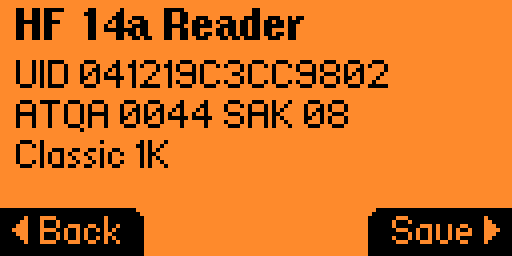
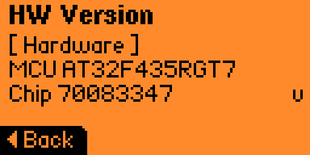
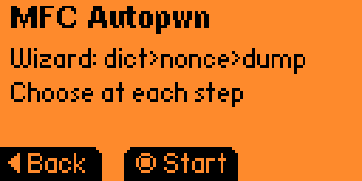
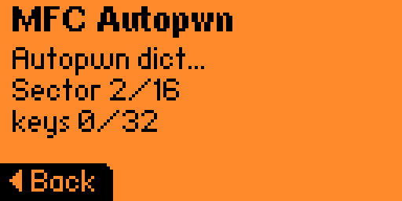
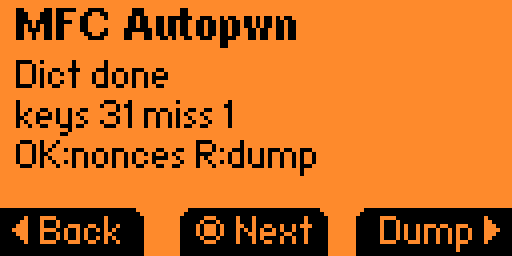
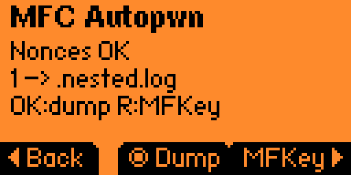
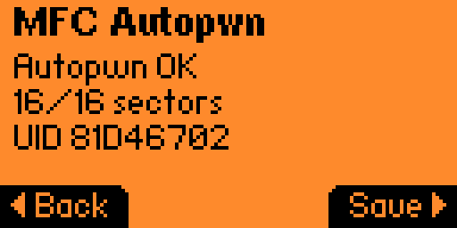
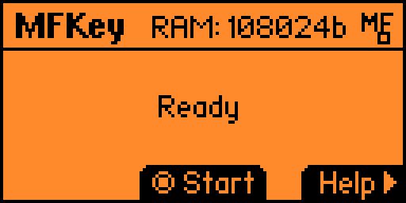

# Proxmark5 Flipper Zero FAP (F0 CEP fork)

Fork of the official [RfidResearchGroup/Proxmark5_FlipperZero_FAP](https://github.com/RfidResearchGroup/Proxmark5_FlipperZero_FAP) app, with experimental **Flipper Zero ↔ Proxmark5 Type-C CEP** UX and a **MIFARE Classic Autopwn wizard**.

> **Status:** experimental. Requires a matching PM5 firmware build with CEP enabled (see companion branch below). Stock upstream firmware often leaves CEP paths disabled — the FAP will stay on “Connecting…”.

## Credits / attribution

This work stands on the shoulders of:

| Who | Contribution |
|-----|----------------|
| **DXL** ([xianglin1998](https://github.com/xianglin1998)) | Original Proxmark5 hardware/firmware & Flipper FAP (`fmps_cxt`) |
| **[RfidResearchGroup](https://github.com/RfidResearchGroup)** / community | Upstream FAP repo, Proxmark3 ecosystem |
| **Iceman** & PM3 contributors | Proxmark3 tooling, protocols, community guidance |
| **Flipper Devices** / Momentum-class firmware | Flipper Zero platform & FAP APIs |
| **limerx** | This fork: Autopwn wizard, CEP-oriented driver tweaks, docs |

Please keep upstream copyright notices and do not remove author credits from `application.fam` / source headers.

## Companion firmware

CEP handshake + SPI NG transport live in:

- Firmware fork: https://github.com/limerx/proxmark3  
- Branch: `pm5-f0-cep` (based on `xianglin1998/proxmark3` branch `proxmark5`)

Flash **only** the Proxmark5 device (`PLATFORM=PM5`). Never flash PM5 firmware onto a Flipper (check USB `ID_MODEL`).

## What’s in this fork

- Autopwn-style flow for MIFARE Classic: dict → optional nonces → dump / MFKey handoff
- Dicts from `/ext/apps_data/fmps_cxt/dicts/` (small `*.dic` only; skips oversized / private-prefixed files)
- Nonce collection path writing Flipper NFC `.nested.log` for [MFKey](https://github.com/noproto/MFKey)
- Hitag2 demo pages removed from the default build (unstable upstream demo)
- Version bump in `application.fam` (see `fap_version`)

## Screenshots

Hardware + UI captures live under [`docs/screenshots/`](docs/screenshots/) (folders follow the in-app menu).

### Setup

Add a Flipper Zero + Proxmark5 Type-C photo in `docs/screenshots/00-hardware/flipper-pm5-cep.jpg` (not committed yet).

### Menu

| Root | PM5 Tools | HF RFID |
|------|-----------|---------|
|  |  |  |

### PM5 Tools

| Ping | HW Version |
|------|------------|
|  |  |

### MFC Autopwn wizard

| Start | Dict | Choice | Nonces | Dump | MFKey |
|-------|------|--------|--------|------|-------|
|  |  |  |  |  |  |

## Build & install

```bash
# Momentum / ufbt toolchain expected
ufbt
ufbt launch
```

App id: `fmps_cxt` — category RFID.

## Legal

Intended for **security research, education, and cards/systems you own or are authorized to test**. Do not use against third-party payment, access-control, or laundry systems without permission.

Upstream Proxmark3 is GPL-3.0; this FAP is distributed as a derivative of DXL/RRG work — see `NOTICE` and keep source available if you redistribute binaries.

## Upstream

- FAP upstream: https://github.com/RfidResearchGroup/Proxmark5_FlipperZero_FAP  
- PM5 / HAL discussion (community): Proxmark Discord & related PRs on the Proxmark3 tree  
